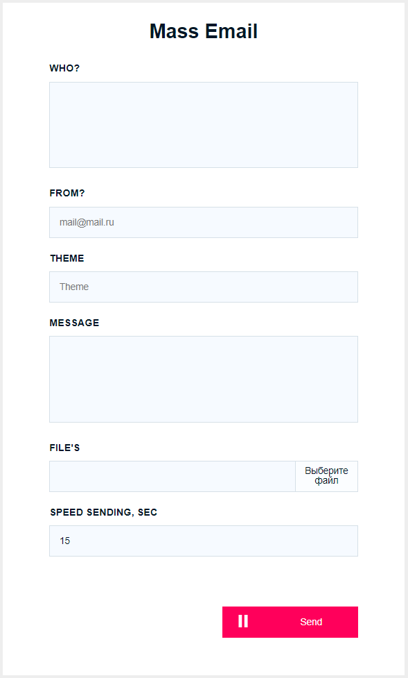

# Mass-mailing

 [Demo Page](http://xn--80adklohlho5j.xn--p1ai/email-sender)

 
This script will allow you to send a lot of emails with minimal entry in spam. 

It is important to note that the script is written in front-end, so it only works from the browser tab.

Before you start working, test it on the available emails.

It is important to note that the file is responsible for sending the message send.php
If you are sending from a hosting service, just copy the dist folder.
If you send from any computer, copy only the file send.php on hosting and specify in the file app.js the path to it. 

## who
This field is for email recipients, separated by commas. After sending, the email will be deleted. This way you can control the sending of all emails.

## from 
This is the sender's field. You can specify any sender.  
<i> * do not abuse spoofing, because your IP address and hosting will be visible.</i>

## theme
This is the subject of the email

## message
Message to recipients.
<i>*without html tags</i>

## files 
You can attach any number of files to a message

## speed
Speed of sending emails. Recommend that you specify more, because if you send frequently, the hosting service may react or email services will send spam. 
